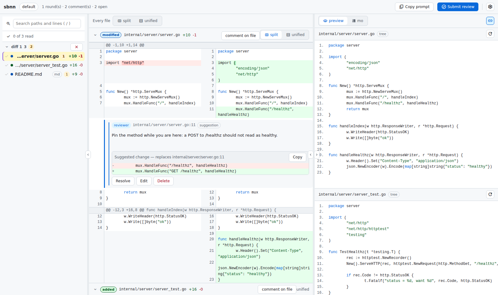

# sbnn

diff viewer and reviewer. The name reads "sabun" — 差分, Japanese for "diff"
— with the vowels dropped.

`sbnn` serves a unified diff as a review page in your browser: GitHub-like diffs
on the left, a Markdown preview on the right, and review comments you can read
back from the command line.



It is inspired by [difit](https://github.com/yoshiko-pg/difit), with a few
deliberate differences:

- **sbnn never runs git.** It reads a diff from stdin, so anything that can
  produce one works: `git diff`, `jj diff`, `diff -u`, a `.patch` file, or a
  coding agent.
- **New files are shown unified**, because there is no old side to put next to
  them.
- **Markdown is previewed in a split pane**, side by side with the diff. sbnn
  renders it itself, needing nothing installed, and
  [mo](https://github.com/k1LoW/mo) renders a richer one for those who
  install it.
- **One server, growing session.** Like mo, the first invocation starts a
  background server and later ones add their diff to it.
- **Comments live in the server**, not in the browser, so an agent can read
  them with `sbnn comments`.

## Install

```console
$ go install github.com/tenntenn/sbnn@latest
```

sbnn renders the Markdown preview itself, so nothing else is needed.
[mo](https://github.com/k1LoW/mo) renders a richer preview for those who
install it — pick it in the preview header once it is on PATH:

```console
$ brew install k1LoW/tap/mo
```

or download it from the [mo releases page](https://github.com/k1LoW/mo/releases).
`go install` does not work for mo: its published module does not carry the
embedded frontend.

## Usage

```console
$ git diff | sbnn                      # start the server and review the diff
$ git diff --cached | sbnn             # add another diff to the same page
$ git diff HEAD~3 | sbnn -t refactor   # a named group with its own URL
$ diff -u old.md new.md | sbnn
$ cat change.patch | sbnn
```

The first invocation starts the server on <http://localhost:6280>, opens a
browser and returns the shell. Later invocations add to the running server.

```console
$ sbnn --status          # what is being reviewed
$ sbnn --clear -t api    # close that review: its diffs, comments and hooks
$ sbnn --clear --all     # close every review the server holds
$ sbnn --restart         # restart, keeping the session
$ sbnn --shutdown        # stop the server
```

**Close** in the header does the same for the review you are looking at, once
it has served its purpose. Closing a review is not the same as stopping the
server: `--shutdown` leaves everything where it is and `--restart` brings it
back, while closing throws the review away.

### Groups

`--target` (`-t`) puts a diff in a named group with its own URL, its own
comments and its own review. What a group stands for is up to you: a task, a
branch, a checkout you keep open next to another one. sbnn does not try to
work any of that out — it only keeps apart what you asked it to keep apart.

`SBNN_TARGET` says it once for a whole shell, which is what a script or an
agent driving several reviews at a time wants:

```console
$ export SBNN_TARGET=hotfix
$ git diff | sbnn            # http://localhost:6280/hotfix
$ sbnn comments              # the comments of the same review
$ sbnn comments -t default   # the flag still wins
```

Group and round are two different sizes, and the words are kept apart on
purpose: a **group** is the whole review — its URL, its comments, its
history — and a **round** is one diff sent into it. A group holds one round
at first and gains another each time you pipe in a new diff, which is what
"start the next round" (below) means: same group, one more diff.

### Stacked pull requests

sbnn has no idea what GitHub is and never runs `git` or `gh` itself, but a
group maps onto a stacked pull request without any extra machinery: one
group per branch, diffed against the branch below it rather than against
main, so the group holds only that branch's own change:

```console
$ git diff origin/main...feature-1 | sbnn --target feature-1 --label pr=101
$ git diff feature-1...feature-2   | sbnn --target feature-2 --label pr=102
$ git diff feature-2...feature-3   | sbnn --target feature-3 --label pr=103
```

`--label` is what carries the PR number or URL along — sbnn stores it and
reads nothing into it, and it rides into `sbnn reviews` so a round can be
matched back to the PR it belonged to later. Once more than one group is
open, the sidebar's **Groups** list turns into a stack of links, one per
branch still under review, each saying how many diffs and open comments it
holds — which reads as the shape of the stack without sbnn having to know
what a stack is.

None of this is required — reviewing a stack works with the default group
and no labels at all — it is only the shape that keeps sbnn's
one-review-per-group model lined up with GitHub's one-review-per-PR model.

### Reviewing

- Select the lines to comment on by dragging over the line numbers, by
  shift-clicking, or - on a touch screen - by tapping one line and then
  another while the draft is open.
- **Comment on the preview by selecting text in it.** Let the drag go and a
  **+** appears where your pointer came up; it opens the same comment form,
  anchored to the source lines of the blocks you selected. The selection
  stays highlighted while you write, and goes away when you click elsewhere,
  press Escape, cancel or post. It needs sbnn's own preview of a whole file:
  mo renders in a frame sbnn may not read, and a partial preview cannot say
  which line anything is on.
- **Suggest a change** drops a ` ```suggestion ` block into the comment,
  pre-filled with the lines as they read today — the same shape GitHub uses.
  It renders as a small diff (the lines now, the lines as proposed) and
  travels through `sbnn comments` as the fenced block itself, so an agent can
  apply it verbatim. A comment can carry prose, several suggestions, or both.
- Comments can be resolved, edited and deleted, and they survive a reload.
- **Copy prompt** puts every open comment on the clipboard, ready for a coding
  agent.
- Split and unified views can be switched per file; new, deleted and binary
  files stay unified.
- **Filter the file list by path.** Press `/` and type: every
  whitespace-separated term has to appear somewhere in the path, so
  `server go` and `internal/server` both find `internal/server/server.go`.
  Enter opens the first path still standing, Escape clears. Nothing turns up
  that does not contain what you typed — a list you are scanning is the wrong
  place for clever matching.
- Each round of a review — each diff sent to the group — gets its own
  heading in the file list. Click it to shut that round — the heading keeps
  saying how many files and how many open comments are inside — or switch
  the list to **tabs** to see one round at a time. Filtering by path
  searches the tabs too: a round with nothing matching drops out of the
  strip, the rest say how many paths they hold, and the search never takes
  you out of the layout you chose.
- Every pane is resizable and can be minimised away: drag the edge between
  two panes, double click it to reset (or to put the file list away), or use
  the **Files**, **Diff** and **Preview** switches in the header. Dragging an
  edge all the way in minimises that pane, and dragging it back out or double
  clicking brings it back. The layout is remembered per browser.
- Markdown files get a preview pane. sbnn renders it itself by default —
  nothing to install, and it can follow the diff as you scroll — and **mo**
  renders it instead when you pick mo in the preview header. The choice is
  remembered. The preview shows the working tree file when it
  exists; otherwise sbnn rebuilds the new side from the diff, which is
  complete for new files and partial for modified ones (a unified diff only
  carries the changed hunks).
- **Sync** makes the preview follow the diff as you scroll, by fraction
  rather than by line — the two documents do not agree on lines, and
  pretending they do lands you in the wrong place with more confidence.
  Scrolling the preview yourself turns it off where you are, and the switch
  turns it back on. It works with sbnn's own preview only: mo is framed from
  another origin, where a page may not touch its scrolling.
- Press `?` for the keyboard shortcuts: `j`/`k` move between files, `n`/`p`
  between comments, `f` folds, `v` switches split and unified, `s` toggles
  the scroll sync, `r` opens the review box, `/` filters the file list. None
  of them fires while you are typing.
- The header switch cycles **Auto / Light / Dark**: Auto follows the system
  (or whatever host an exported page is read in), and a choice is remembered
  per browser. The Markdown preview keeps mo's own theme — mo has its own
  switch, in the toolbar inside the preview.
- On a phone the page shows one pane at a time behind a **Files / Diff /
  Preview** tab bar, and the diff drops to unified. The preview is rendered by
  the page itself there — mo keeps its own sidebar inside the frame, which
  would leave a column too narrow to read — and **Open in mo** opens the real
  mo page in its own tab.

### Folding away what nobody reads

A diff often carries files nobody reads line by line: a lock file, a
directory of build output, generated bindings. sbnn folds those away — shut,
not hidden — for exactly two reasons, and neither is sbnn's own opinion.

**The sender says so.** Whoever produced the diff knows what their generated
files are called, so that knowledge arrives with the diff:

```console
$ git diff | sbnn --collapse 'go.sum' --collapse 'web/dist/**'
$ git diff | sbnn --collapse "$(git ls-files ':(attr:linguist-generated)' | paste -sd,)"
```

Patterns work like `.gitignore`: no slash matches the name at any depth,
`**` is any run of directories, and one `--collapse` can carry a
comma-separated list. sbnn matches them and reads nothing into them — it does
not know what a generated file is, and does not read `.gitattributes`
itself, because that would be sbnn knowing about git.

**The file says so.** A file carrying `// Code generated by … DO NOT EDIT.`
or `@generated` near its top is declaring itself, in a line its generator
wrote precisely so tools would leave it alone. The same declaration written
in Japanese counts too — `自動生成`, `自動的に生成`, `編集しないで`, `編集不可`,
`手動で編集しない` — because a generated file does not become less generated
for saying so in Japanese. sbnn shows which line it found:

```
Folded — the file says so: // Code generated by protoc-gen-go. DO NOT EDIT.
Folded — the file says so: // このファイルは自動生成されています。編集しないでください。
```

`@generated` is still the portable answer, understood by GitHub and others
as well as by sbnn, and worth emitting from generators you control.

Nothing is folded on size, path or extension. Those would be sbnn guessing
about a project it knows nothing about, and a file folded for a bad reason
is a file nobody reads. For the same reason a folded file keeps its row in
the list and its `+`/`-` counts, opens with one click, and is never folded
while it carries a comment. Any file can also be folded by hand with **fold**
in its header, which needs no judgement at all.

### Comments from an agent

The loop goes both ways: an agent can point at the lines it is unsure about,
ask a question, or propose a change, and you see it in the browser next to
the diff, labelled with who wrote it.

```console
$ sbnn comment internal/server/server.go:120 -m "Should this be a 404?" --author claude
$ sbnn comment README.md:12-18 -m "Reworded" --suggest-file new.md --author claude
$ cat new.txt | sbnn comment main.go:42 -m "Simpler" --suggest -
```

`--suggest` appends the replacement to the comment as a ` ```suggestion `
block; the same block can be typed straight into `-m`.

`--question` marks a comment as wanting an answer rather than a change —
**Question** next to the comment box does the same in the browser. The two
requests read alike in prose ("should this be a 404?" is either), so whoever
writes the comment says which it is, and `sbnn comments` tells the reader:
*This one is a question: answer it.*

The lines are the ones the diff shows (`--side old` for a removed line), the
file is looked up in the newest diff carrying that path, and sbnn fills in the
reviewed code itself. A whole self review can be posted at once:

```console
$ sbnn comment --json --author claude <<'EOF'
[
  {"path": "cmd/root.go", "line": "88", "body": "left over from the old flag"},
  {"path": "README.md", "line": "12-18", "body": "reworded", "suggestion": "..."}
]
EOF
```

### Finishing a review

**Submit review** in the header says "I am done looking". That is the moment
sbnn tells everything that is waiting — an agent, a script, another machine —
that the comments are worth reading. It asks for one thing more: what you
decided about the change as a whole, as **Approve**, **Comment** or
**Request changes**, the same three a pull request review has. An optional
note goes with it and shows up at the top of the prompt. Sending another
diff starts the next round, and the group counts as unreviewed again.

The verdict is a separate question from what any one comment says, which is
why sbnn asks instead of counting: approving with three remarks on the change
is a normal thing to do, and so is sending a change back without pointing at
a single line. Whoever reads the review is told which it was, in those
words — `sbnn comments` opens with "The reviewer approved the change; anything
below is worth reading but does not block it", or with "asked for changes;
the change should not go ahead as it is".

### Waiting, and being woken up

A review lands when the human is ready: after the meeting, after lunch,
tomorrow. Two ways to be there when it does.

**Wait for it.** `sbnn wait` blocks on the server's event stream — no polling,
nothing missed, and a review that already happened returns straight away:

```console
$ git diff | sbnn --target api
$ sbnn wait --target api                 # returns when the review is submitted
$ sbnn wait --target api --timeout 30m   # exits with status 2 if it is not
```

**Or have the server start the work.** Register what to do and go away; sbnn
runs it when the human presses Submit review, whether or not anyone is still
around:

```console
$ git diff | sbnn --on-review 'claude -p "$(sbnn comments)"'
$ sbnn hook --on-review-url http://localhost:9000/reviews   # a POST instead
$ sbnn hook            # what is registered
$ sbnn hook --clear
```

The command runs through the shell with the review prompt on its stdin and
`SBNN_GROUP`, `SBNN_URL`, `SBNN_SERVER`, `SBNN_PORT`, `SBNN_COMMENTS` and
`SBNN_REVIEW_NOTE` in its environment. Hooks belong to a group and survive a
restart. They run a command of your own on your own machine, which is what
makes them useful and worth being deliberate about.

### Reading the comments back

```console
$ sbnn comments                    # Markdown, ready to paste into an agent
$ sbnn comments --format json      # machine readable
$ sbnn comments -t api             # comments of the "api" group
$ sbnn comments --clear            # start the next review round
```

### Approve, comment, or request changes

A review says two different things: what is wrong with particular lines, and
what the reviewer decided about the change as a whole. Counting comments
does not answer the second — a change can be approved with three remarks on
it, and can be sent back without a single line being pointed at — so sbnn asks
for it. The browser offers the three buttons; `sbnn submit` takes the same
three, and the verdict is what `--exit-code`, the prompt an agent reads, and
the log all repeat.

### Reviewing without a browser

The reviewer does not have to be a person. Comments go in from the command
line, and `sbnn submit` is the Submit button — it wakes whoever is waiting,
starts the hooks, and writes the round into the log:

```console
$ sbnn comment internal/server/server.go:166 --author code-review \
    -m "any site can POST here, and a hook is a shell command sbnn runs"
$ sbnn comment --json --author code-review < findings.json   # many at once
$ sbnn submit --approve -m "fine by me"                      # it can go ahead
$ sbnn submit --request-changes -m "not like this"           # it should not
$ sbnn submit -q && echo "nothing blocking"                  # 0 clear, 1 not
```

Two things make such a review checkable rather than merely confident: each
comment is anchored to a `path:line` and stored with the code it is about,
and `--author` keeps it apart from what the human wrote. Which is what makes
the log worth reading afterwards — you can see whether the machine was
pointing at the same places the person did:

```console
$ sbnn reviews --comments | awk -F'\t' '{print $4}' | sort | uniq -c
```

### Putting it in a pipeline

sbnn reads a diff on stdin and writes text on stdout, so it joins the commands
you already run rather than replacing them. `sbnn comments` and `sbnn wait` also
say what they found in their exit status — 0 when there is nothing to
address, 1 when there is, 2 from `sbnn wait` when the review has not happened
yet — which is enough to gate whatever comes next:

```console
$ git diff | sbnn
$ sbnn wait -q && git commit -m "..."      # commit once the review is clean
$ sbnn comments -q || echo "still something to fix"
$ sbnn reviews --comments | cut -f3 | sort | uniq -c | sort -rn
```

sbnn writes nothing into your working tree — the session, the log and the
rebuilt previews all live outside it — so `git status` says the same before
and after a review. Nothing opens a browser when stdout and stderr are not a
terminal, so a job or a pipeline stays quiet unless you pass `--open`.

## Looking back at reviews

Every submitted review is written down, so the rounds do not vanish with the
groups they belonged to:

```console
$ sbnn reviews                     # one line each, newest last
$ sbnn reviews --since 7d          # this week
$ sbnn reviews -t api --limit 5
```

```
2026-08-16 03:26  default    2 comment(s), 1 suggestion(s)  3 file(s), +11 -1  waited 42m
      だいたいOK
2026-08-16 11:02  api        1 comment(s)  3 file(s), +11 -1  waited 3h10m  branch=main
```

`--stats` reads a pile of them together — and prints only when asked:

```console
$ sbnn reviews --stats
2 review(s), 3 comment(s) (1.5 per review), 1 suggestion(s)
median wait from diff to review: 1h24m
most commented:
  internal/server/server.go                7
  README.md                                5
by kind of file:
  .go                                     22
  .md                                      9
by author:
  reviewer                                31
  claude                                   8
```

Any other analysis is not sbnn's job: sbnn hands the data to the tools that
already answer questions about streams of records, and what to count is up
to the pipe. `--comments` turns the log into one record per comment. Parse
the jsonl form — one flat JSON object per line; fields get added over time
but not renamed. The text form is five tab-separated columns (date, group,
`path:lines`, author, first line of the body): fine for eyes and quick
pipes, lossy by design, because only jsonl carries the whole body.

```console
$ sbnn reviews --comments --format jsonl | jq -r 'select(.suggestions) | .path'
$ sbnn reviews --comments | cut -f3 | cut -d: -f1 | sort | uniq -c | sort -rn
$ sbnn reviews --comments --since 90d | awk -F'\t' '{print $4}' | sort | uniq -c
```

A diff can be sent with `--label key=value` (repeatable), and the pairs ride
along into the record of the review. sbnn stores them and reads nothing into
them — they are whatever you will want to join on later, a revision, a
branch, a ticket:

```console
$ git diff | sbnn --label rev=$(git rev-parse --short HEAD)
$ sbnn reviews --format jsonl | jq -r '"\(.labels.rev // "-")\t\(.comments | length)"'
```

A label you forgot to send is not lost: the log is only a file, so `jq` can
rewrite it after the fact.

The log itself is one JSON object per line at
`$XDG_STATE_HOME/sbnn/reviews.jsonl` (`--history-file` or `$SBNN_HISTORY` to keep
it elsewhere, `off` to keep none), so `jq` works on it directly and nothing
about it is sbnn-shaped. `sbnn reviews --file` reads any such file, `-` reads
stdin, which is how logs combine:

```console
$ jq -r '.comments[].path' ~/.local/state/sbnn/reviews.jsonl | sort | uniq -c | sort -rn
$ cat mine.jsonl theirs.jsonl | sbnn reviews --file - --stats
```

Keep the log outside the working tree (the default is outside): a log inside
the tree is appended to on every submit and would dirty the very diff it is
a log of. It stays on the machine that recorded it. Delete the file to
forget the lot.

## Exporting a review

`sbnn export` writes the whole review as one self-contained HTML page: the same
UI, with the diff frozen into it and no server, no mo and no network behind
it. It is how a review reaches someone who does not run sbnn — attached to a
mail, dropped in a bucket, or published as an artifact.

```console
$ git diff | sbnn export review.html    # straight from stdin, no server needed
$ sbnn export -t api review.html        # the "api" group of a running server
$ git diff | sbnn export                # to stdout
$ git diff | sbnn export --fragment page.html   # body only, to embed elsewhere
```

On an exported page the diff is read-only, but reviewing still works:
comments can be written, resolved and edited (they are kept in that browser),
Markdown is rendered by the page itself instead of mo, and **Copy prompt**
produces exactly what `sbnn comments` would.

## Agent skill

sbnn ships a vendor neutral agent skill: one Markdown file with YAML front
matter that describes the review loop — send the diff, hand the URL to the
human, read the comments back, address them, start the next round — entirely
in terms of the sbnn command line. Nothing in it is specific to a vendor, so any
agent that can read an instruction file can use it.

The source is [`skills/sbnn/SKILL.md`](skills/sbnn/SKILL.md) and it is embedded in
the binary, so the copy you install always matches the sbnn you are running.

### Installing it

```console
$ sbnn skill                          # print SKILL.md to stdout
$ sbnn skill --list                   # list the files the skill consists of
$ sbnn skill --install <dir>          # write <dir>/sbnn/SKILL.md
$ sbnn skill --install <dir> --force  # overwrite an older copy
```

`--install` writes the skill as a `sbnn/` directory inside the directory you
name, and refuses to overwrite an existing file unless `--force` is given, so
re-running it after upgrading sbnn is a one-liner:

```console
$ sbnn skill --install ~/.claude/skills --force
```

Where `<dir>` should point depends on the agent. The common ones:

| Agent | Command |
| --- | --- |
| Claude Code, this project only | `sbnn skill --install .claude/skills` |
| Claude Code, all your projects | `sbnn skill --install ~/.claude/skills` |
| Anything that reads `AGENTS.md` (Codex, Jules, …) | `sbnn skill --install .agents/skills`, then link it (below) |
| An agent with its own rules directory (Cursor, Cline, …) | install into that directory — check the agent's docs for the path and the file naming it expects |
| No skill support at all | `sbnn skill >> AGENTS.md` (or the agent's instruction file) |

For agents that read `AGENTS.md` rather than a skills directory, install the
file and point at it from `AGENTS.md`:

```markdown
## Reviewing changes

Before showing a diff to a human, read [.agents/skills/sbnn/SKILL.md](.agents/skills/sbnn/SKILL.md).
```

That is exactly what this repository does — see [`AGENTS.md`](AGENTS.md).

### Checking that it took

Ask the agent to review something and watch what it runs: it should pipe a
diff into `sbnn --target <topic>`, give you the URL, wait, and then read your
comments with `sbnn comments`. If it does not, most agents need the skill
directory to be picked up at session start, so start a new session after
installing.

## How the Markdown preview works

By default sbnn asks itself for the file's Markdown and renders it in the page
— nothing else runs, and it is the rendering that can follow the diff as you
scroll.

Picking **mo** in the preview header instead makes sbnn run
`mo --json <file> --target sbnn-<group>` and embed the page mo answers with.
mo sends `frame-ancestors 'none'` on every response, so a page cannot frame
it directly; sbnn therefore publishes mo through a loopback-only reverse proxy
that rewrites that one directive to allow sbnn's own origin, and forwards
everything else — the rest of mo's CSP included — unchanged. "Open in mo"
always links to mo itself.

Two places never offer mo, because mo cannot be there: an exported page (no
server behind it) and a phone (no room for mo's own layout inside the
frame). Both always render Markdown themselves and keep a link to mo for
the full thing.

Note that mo cannot be used as a Go library today: everything but its cobra
entry point lives under `internal/`, and the published module does not build
because the embedded frontend is not part of it.

## Files and ports

| What | Where |
| --- | --- |
| sbnn server | `localhost:6280` (`--port`) |
| mo server | `localhost:6275` (`--mo-port`) |
| Preview proxy | a loopback port picked at startup |
| Session state (diffs, comments, hooks) | `$XDG_STATE_HOME/sbnn/session-<port>.json` |
| Server log | `$XDG_STATE_HOME/sbnn/server-<port>.log` |
| Rebuilt previews | `$XDG_CACHE_HOME/sbnn/preview/…` |
| Exported pages | wherever you point `sbnn export` |

sbnn binds to loopback and has no authentication; `--dangerously-allow-remote-access`
is required to bind anywhere else.

## Development

The UI is React + Vite, embedded into the binary with `go:embed`. The built
assets are committed so that `go install` needs no Node.

Tools are managed with [aqua](https://aquaproj.github.io/); run `aqua install`
to get `task`.

```console
$ task build     # pnpm build in web/, then go build
$ task test      # go test ./...
$ task dev       # sbnn in the foreground plus the Vite dev server
```

## License

MIT
